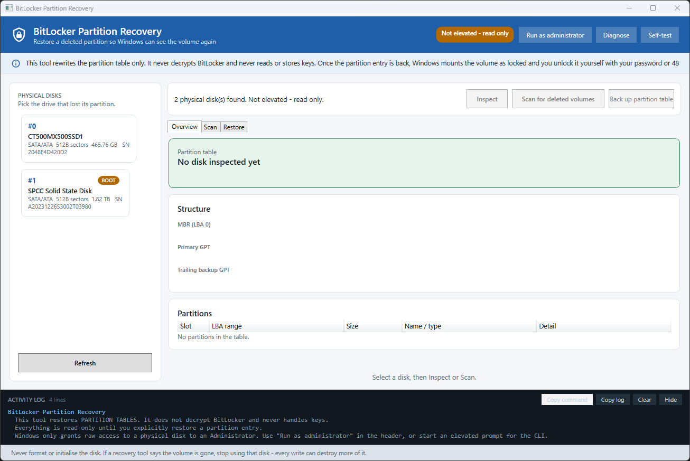
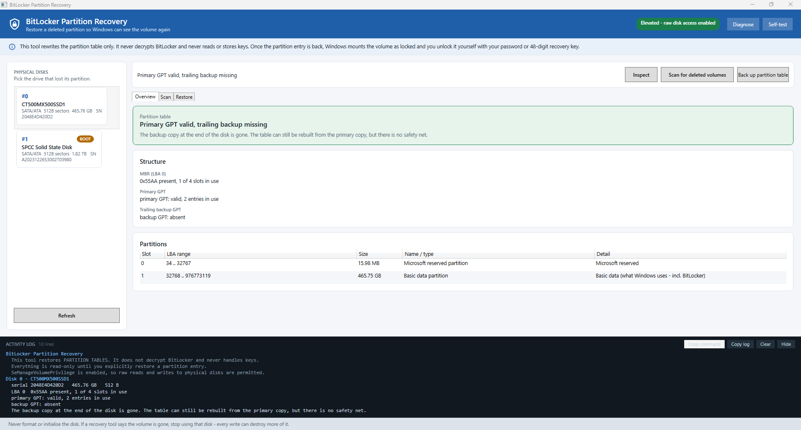
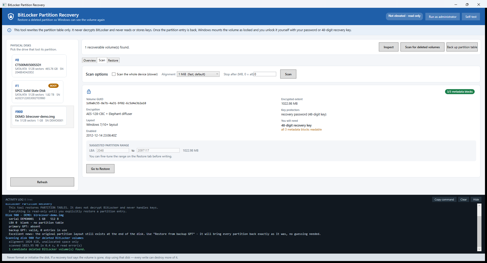

# blrecover — recover a deleted BitLocker partition

Locate a BitLocker volume whose **partition entry was deleted**, and put the partition table
back so Windows can see it again. The volume then unlocks normally with your own password or
48-digit recovery key.

**This tool never decrypts anything and never touches key material.** It only reads
cleartext metadata and rewrites partition-table sectors.





---

> [!IMPORTANT]
> **Please read this before you use the tool.**
>
> `blrecover` was written by one person, for one situation: to recover my own accidentally
> deleted BitLocker-encrypted partition. It is not a commercial product, it has not been
> audited or reviewed by anyone else, and it should be treated as **unproven software** until
> you have validated it on a copy of your own data.
>
> I reached the point where the partition table had been written back and Windows could see
> the volume again — but I did not have the 48-digit recovery key, so I was never able to
> complete the final unlock. **I therefore cannot confirm that a recovered volume mounts and
> its data is intact, end to end, on a real drive.** Treat that as unverified.
>
> **I take no responsibility for any loss of data, damaged partition tables, or any other
> consequence of running this software.** You are responsible for the outcome of every write
> it performs.
>
> Before you write to a physical disk: back up the whole drive to a separate medium, and
> rehearse on a synthetic practice image first (see *Rehearse on a fake disk first* below). If
> the volume header is gone or the space has been reused, no tool can bring it back — stop
> writing to that disk, because every write destroys more of what is left.

---

## First: is your drive actually encrypted?

You may not have set up BitLocker yourself — **Windows 11 device encryption can enable it
automatically.** The tool answers this from the first sector of the old volume, which the
deletion left completely intact:

```powershell
blrecover dump --disk 0 --lba 2048
```

| `signature @3` | Meaning | What you need |
|---|---|---|
| `NTFS    ` | Never encrypted | **Nothing.** The files are readable as soon as the partition entry is back |
| `-FVE-FS-` | BitLocker is on | Your unlock password, or the 48-digit recovery key |
| `-FVE-FS-` at offset 0 | A FVE metadata block | You are looking at the wrong sector |
| all zeros | Header destroyed | Nothing to restore |

`analyze` reports this for you and says plainly which of the two cases you are in. A paid tool
that labels the partition `BitLocker` has read that signature — it is not guessing.

If BitLocker *is* on, the recovery key is almost certainly recoverable: Windows saves it
automatically when device encryption is enabled, so check
**https://account.microsoft.com/devices/recoverykey** (or `manage-bde -protectors -get X:`).

`blrecover` detects BitLocker, NTFS, exFAT, FAT32, FAT16 and FAT12, so an unencrypted backup
drive is found and reported just as well — with the partition size taken from the volume's own
BIOS parameter block, which is a better record than anything reconstructed.

---

## Your case, specifically

From the screenshots of Partition Recovery Wizard, and confirmed here with `Get-Disk`:

| | |
|---|---|
| Disk | `\\.\PhysicalDrive0` — **CT500MX500SSD1** (Crucial MX500, 500 GB) |
| Serial | `2048E4D420D2` |
| Size | 500,107,862,016 bytes = **976,773,168** sectors of 512 B |
| Current state | GPT, **0 partitions** (fully unallocated) |
| Lost volume | BitLocker, **LBA 2048 → 976771071** (465.76 GB) |

Disk 1 (SPCC Solid State Disk) is your **boot** disk. Do not write to it.

That is the classic `diskpart clean` / accidental-delete signature: the GPT is intact but
**empty**, and the BitLocker data — including all three FVE metadata blocks — is still on the
SSD. Partition Recovery Wizard found the volume; it just would not write the table for free.

### Runbook

```powershell
# 1. Build
cd C:\path\to\blrecover
.\build.ps1

# 2. Look at the disk (needs an Administrator prompt)
#    Right-click Windows Terminal / PowerShell -> Run as administrator
.\build\bin\Release\net10.0-windows\blrecover.exe inspect --disk 0
.\build\bin\Release\net10.0-windows\blrecover.exe analyze  --disk 0
```

`analyze` should report, in unallocated space:

```
[1] start LBA 2048  (byte offset 1048576)
  metadata blks : 3 of 3 readable
  -> suggested  : LBA 2048..976771071  (465.76 GB)
```

If the **trailing backup GPT is intact**, `analyze` will say so and the cheapest fix is one
command that brings the *original* layout back with no guessing:

```powershell
.\build\bin\Release\net10.0-windows\blrecover.exe restore-gpt --disk 0 --apply
```

Otherwise write the entry the scanner found:

```powershell
blrecover add-gpt --disk 0 --first 2048 --last 976771071 --name "Recovered" --apply
```

Then:

```powershell
diskpart          ->  rescan
manage-bde -status
```

Your volume should appear, locked. Unlock it in Explorer with your password or recovery key.
Back it up immediately.

### Or use the GUI

```powershell
.\build\bin\Release\net10.0-windows\BlRecover.App.exe
```

Pick **Disk #0 CT500MX500SSD1** → *Inspect* → *Scan for deleted volumes* → *Go to Restore* →
tick the two confirmations → *Write partition entry*.



The GUI shows the same engine output in the activity log. **Run as administrator** (button in
the header) is required before any write button enables.

---

## What the research showed

The mechanism is simple once you know it: **deleting a partition destroys only the table
entry.** Everything BitLocker needs to unlock is still on the disk, in cleartext, at the start
of the partition.

### What a BitLocker volume looks like on disk

At the first sector of the BitLocker volume there is a volume header whose signature is
`-FVE-FS-` at offset 3 (in place of `NTFS    `), followed by a boot entry point. It points at
**three redundant FVE metadata blocks** near the front of the volume, each 64 KiB and each
starting with `-FVE-FS-` at offset 0.

| Variant | Signature @3 | FVE block offsets | BitLocker GUID |
|---|---|---|---|
| Windows Vista | `-FVE-FS-` (boot `EB 52 90`) | block 1 = LCN@0x38 × cluster size; 2/3 from the block header | — |
| Windows 7/10+ | `-FVE-FS-` (boot `EB 58 90`) | u64 @ 176 / 184 / 192 | @160 |
| BitLocker To Go (FAT) | `MSWIN4.1` | u64 @ 440 / 448 / 456 | @424 |

FVE metadata **block header** (64 bytes):

| Offset | Size | Field |
|---|---|---|
| 0 | 8 | `-FVE-FS-` |
| 16 | 8 | `encrypted_volume_size` — **this is how the original partition size is recovered** |
| 28 | 4 | `number_of_volume_header_sectors` |
| 32/40/48 | 8 ea. | the three block offsets |
| 56 | 8 | `volume_header_offset` |

FVE metadata **header** (48 bytes, at block+64): `metadata_size` @0, **volume GUID** @16,
**encryption method** @36, creation FILETIME @40. Then an entry array
(`u16 size, u16 type, u16 value type, u16 version, value…`).

Key protectors live in VMK entries (`type 0x0002`) at entry+26: `0x0000` clear key, `0x0100`
TPM, `0x0200` startup key, `0x0500` TPM+PIN, `0x0800` recovery password, `0x2000` password.
Encryption methods: `0x8000` AES-128-CBC+diffuser … `0x8005` AES-XTS-256.

Sources: [libbde format spec](https://github.com/libyal/libbde/blob/main/documentation/BitLocker%20Drive%20Encryption%20(BDE)%20format.asciidoc),
[securityronin/bitlocker-forensic RESEARCH](https://securityronin.github.io/bitlocker-forensic/RESEARCH/),
[libbde/dislocker sector decryption](https://github.com/Aorimn/dislocker),
[FERGUSON06 AES-CBC + Elephant diffuser](https://www.cs.auckland.ac.nz/~stevenedo/classes/780677/2006_2/crypto/bde.pdf).

### Why the two GPT copies matter

A GPT keeps the table twice: at the start (LBA 1) and at the **very end of the disk**. `diskpart
clean` only destroys the copy at the start. The trailing copy usually survives intact — which
means the original partition layout, including the deleted entry, is often still recorded on
the disk. Rebuilding from it needs no inference at all.

`blrecover` therefore checks both copies, verifies both CRCs, and reports where they disagree.

### What the commercial tools do

TestDisk, R-Studio, DiskGenius, Hasleo and friends all scan for the `-FVE-FS-` signature and
recreate the partition entry — the same operation `blrecover add-gpt` performs, with a
correctly recomputed GPT header CRC and entry-array CRC. The paid tier is the licensing, not
the technique. The one thing they may do better is decrypt-and-preview, which `blrecover`
deliberately does not do.

### When it will not work

- The space was **reused or reformatted** after deletion — the volume header is gone.
- **TRIM** already discarded the blocks on an SSD.
- All three FVE metadata blocks are damaged — the Volume Master Key cannot be derived even
  with a correct recovery key. `blrecover` reports `n/3 metadata blocks readable` so you know.

---

## Safety model

Nothing is written unless **all** of these hold:

1. The command has `--apply` (CLI) or the confirmations are ticked (GUI).
2. The process is **elevated** — Windows denies raw `\\.\PhysicalDriveN` access otherwise.
3. The target range does **not** overlap the GPT structures themselves. This is a hard block
   that `--force` cannot override.
4. A **safety backup of the first and last 1 MiB** of the disk was written successfully — and
   both files were read back and proven byte-identical to the device before the write continued.
5. A confirmation dialog/ prompt requiring the disk's **serial token** to be typed back.

Extra guards: entries are validated against the usable LBA range and against each other before
a table is emitted, so a table that Windows would reject is never written. The boot disk is
flagged and refuses to proceed without `--force` — this applies to **`restore-gpt` as well as**
`add-gpt` / `add-mbr`, and to the GUI's "Restore primary GPT from backup GPT" button. A practice
image is never gated, so you can rehearse without `--force`. Writing over the GPT structures
themselves is a hard block that `--force` cannot override.

Partition **data** is never written. Only LBA 0, the two GPT headers and the two entry arrays.

---

## Command line

```
blrecover <command> [options]

list                        enumerate physical disks
inspect --disk N            parse MBR + both GPT copies, report health
scan --disk N               find BitLocker volume headers in unallocated space
analyze --disk N            inspect + scan + print the exact restore command
backup --disk N             save the first and last 1 MiB
restore-gpt --disk N        rebuild the primary GPT from the trailing backup GPT
                          (add --force if N is the boot disk)
add-gpt --disk N            add a partition entry for a recovered volume
add-mbr --disk N            the same, for an MBR disk
verify --disk N             re-read and check the table
dump --disk N               hex dump a region (--offset BYTES or --lba N)
mkimage --path FILE         create a synthetic BitLocker image to rehearse on
selftest                    run the built-in test suite

--disk N | --image PATH     target
--sector-size N             override the logical sector size (512/4096)
--align-kb N                sweep granularity (default 1024 = 1 MiB)
--full                      scan allocated space too
--max-offset-mb N           stop early
--first / --last / --size   the partition range
--name / --type             GPT name / type GUID (default Basic Data)
--force                     proceed despite warnings (e.g. the target is the boot disk)
--backup-dir DIR            where safety backups go
```

### Rehearse on a fake disk first

```powershell
# a 1 GiB image that mimics the cleaned-GPT failure
blrecover mkimage --path C:\temp\practice.img --size-mb 1024 --clean
blrecover analyze --image C:\temp\practice.img
blrecover add-gpt --image C:\temp\practice.img --first 2048 --last 2093997 --apply
blrecover verify --image C:\temp\practice.img

# the same thing but unencrypted - to rehearse the "no key needed" path
blrecover mkimage --path C:\temp\plain.img --size-mb 1024 --clean --filesystem ntfs
```

Images are **sparse** — a 465 GB practice image costs about 400 KB of real disk space.

---

## Project layout

```
BlRecover.sln
build.ps1                    build / self-test / self-contained publish / -Clean
src/
  BlRecover.Core/            the engine, as a library
    Util.cs            binary readers, CRC-32, formatting, the Log bus
    RawDisk.cs         block I/O over \\.\PhysicalDriveN or an image file; disk enumeration
    Native.cs          the CreateFile/ReadFile/WriteFile/IOCTL surface
    Privileges.cs      SeManageVolume + SeBackup/SeRestore, reported one by one
    Mbr.cs             MBR / protective-MBR parsing and editing
    Gpt.cs             GPT header + entry array parse, compare, rebuild, CRC-correct write
    Fve.cs             BitLocker volume header and FVE metadata parsing (Vista/Win7+/To Go)
    Scanner.cs         free-range streaming scan for -FVE-FS- headers
    Restorer.cs        preflight, safety backup, confirmation gate, write + verify
    VolumeProbe.cs     recognises NTFS / exFAT / FAT boot sectors and reads the BPB
    Diagnose.cs        read-only breakdown of exactly why raw access is refused
    RecoveryService.cs the API the GUI consumes
    ImageFactory.cs    synthetic image builder (sparse)
    SelfTest.cs        143 assertions over synthetic disks
  BlRecover.Cli/     Program.cs — the console front end
  BlRecover.App/     WPF + MaterialDesignThemes 5.3.2 front end
```

Each project owns the sources it compiles: there is no shared-source glob, so a new `.cs` file
lands in the project that should contain it and nothing else picks it up by accident.

`--ui-smoke-test` loads the real window and walks the visual tree; `--ui-demo` fills the GUI
from a synthetic image. Both are safe — no real disk is touched.

## Requirements

- .NET 10 SDK to build. `.\build.ps1 -SelfContained` produces a single GUI exe needing no runtime.
- Windows 10/11. Administrator for anything that touches a physical disk.
- MaterialDesignThemes 5.3.2, System.Management (restored automatically).

---

## License

MIT — see [LICENSE](LICENSE).

The MIT licence covers the *source code only*. It is not a warranty of fitness,
and it does not make anyone liable for data you lose while using this tool. See
the notice at the top of this file and [SECURITY.md](SECURITY.md) before you run
it against a disk that matters to you.
